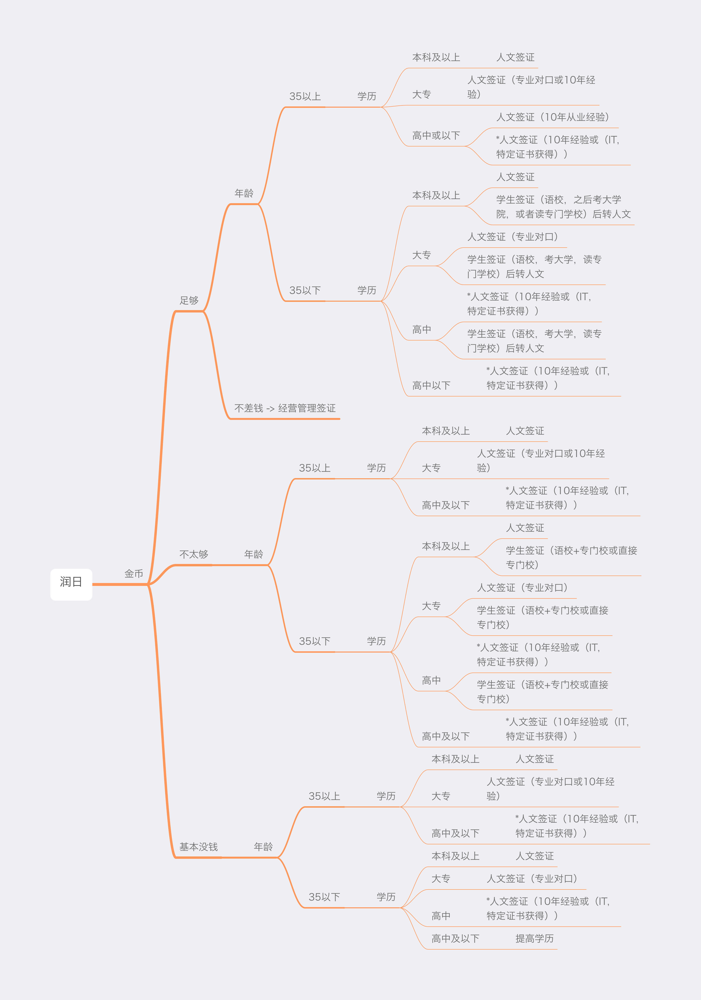

## 润日思维导图

最后一次更新时间: 2023-01-15

## 几点说明

- 35岁以上申请各种学签均有风险，人文签是最靠谱的。为了降低导图复杂度，在大于35岁的分支中去掉了学签，但不代表不能尝试。但是切记你每一次签证获批或者拒签都会变成下一次签证的影响因素。
- 金币里，足够，不太够，没钱的范围是指？ 这个范围不固定，大概是，每年能掏出10个金币以上的，每年能掏出5个金币以上10个金币以下的，每年能掏5个金币以下的。
- 我只列出了学签，人文签和经营管理签， 因为这三种签证是最适合绝大多数人的签证。还有其他的签证我会在以后介绍。
- 人文签就是工签。
- 人文签证可以换成高度人才签证，可以更快拿到PR（永居）。但PR不是身份，国籍才是。
- 影响选择的因素有**金币**，**年龄**和**学历**，其中越靠近根部（最左侧的润日）的， 代表影响力越大。影响力最大的是金币，影响力最小的是学历。各位大龄跑路人不要焦虑。
- 35岁不是法律规定的，而是一种较为普遍的认知。
- 35岁以下如果要申请学签基本上是要求18岁的，工签更不必说了。
- 前面带有*的内容，为日本法律允许，但是目前我没有在中国找到任何实例的，如果有未来我会更新。
- 如果最终目的是润日，那么学生签证的存在只有一个目的就是换成人文签证等可以移民的签证。

